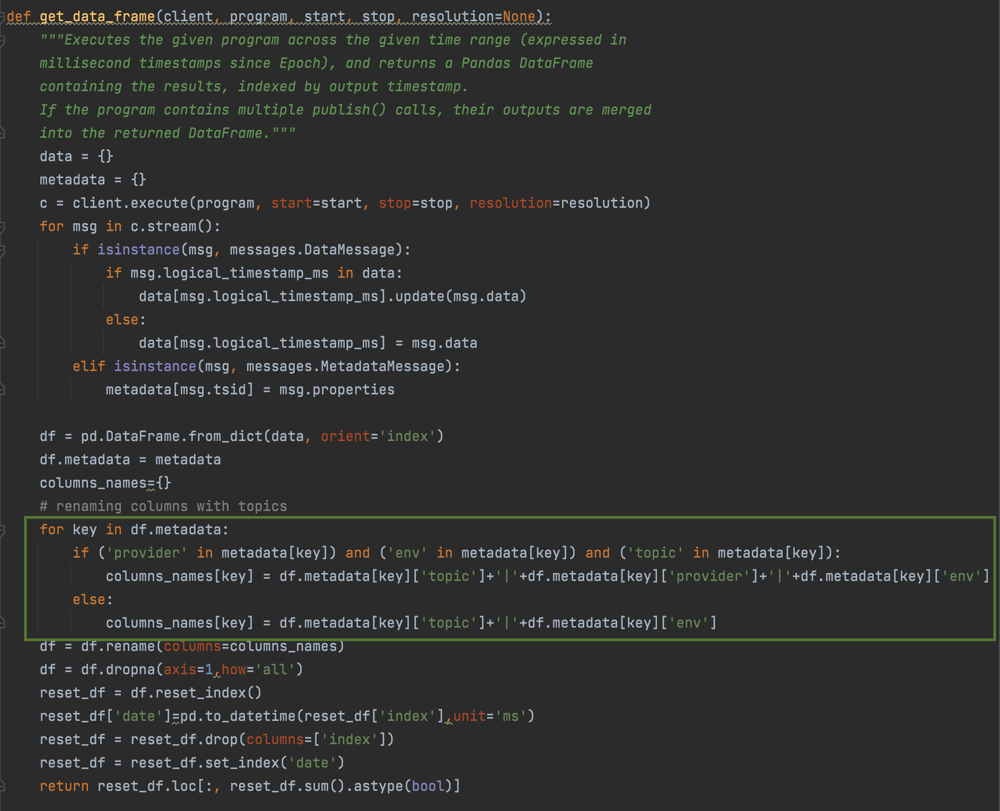

## Time Series Anomaly Detection Library
### Notes
* utils.py contains data loading, checking, and querying functions
* model.py contains model fitting and anomaly detection/visualization functuons
* Meant to catch long term anomalies
* Two models
  * ExponentialSmoothing from statsmodels
  * Facebook's Prophet
* All parameters specifying time require epoch time in ms

### Data Loading Functions
There are two example functions to load data from signalFx. 
These are not made generalized yet, so it may be easier to use the 'export as CSV'
function from the SignalFx UI.

If you choose to load data within Python you may need to make changes to the data loading
functions highlighted in the green block.

The unique_metadata_len() can help you with that.

### Data Quality Checks Functions
These functions can help you check the correct date ranges, check missing data,
or check how many negative or zero entries there are. 

### Data Querying Functions
filter_df() can help filter the dataframe by a keyword. (e.g. "stats" will only include columns
with "stats" in column name)

### Model Fitting and Anomaly Detection
If there are known anomalies, use remove_known_outliers() to prevent overfitting. The function
removes data points between date ranges using epoch time. Both statsmodels and Propget can handle missing 
data. 

#### statsmodels 
* Returns visualization of data and anomalies if present.

parameters
* df – pandas dataframe
* metric – column name (string)
* resamp_freq – resampling frequency ("20T" = 20min) (string)
* stdev = 5 
  * arbitrarily set to 5 standard deviations away from forecast to avoid false positive
  * can be tuned depending on your use case

#### Prophet

fit_prophet() parameters

* df – pandas dataframe
* metric – column name (string)
* resamp_freq – resampling frequency ("20T" = 20min) (string)
* interval_width = .99
* changepoint_range = .01
  * interval width and changepoint range are set to maximize prediction bands to avoid false positive
  * can be tuned depending on your use case

Fits the data and returns dataframe of predictions. Also returns small simple data visualization with
trends.

detect_anomalies() parameters
* forecast - takes in dataframe (the output from fit_prophet())

Returns dataframe. Determines if a datapoint is an anomaly if it is above yhat_upper (prediction upper 
band) and yhat_lower (prediction lower band). If it is an anomaly, calculates the
importance using the equation abs(prediction-true)/true.

plot_anomalies() parameters
* forecasted - takes in dataframe (the output from detect_anomalies)

Outputs visualization of datapoints with upper and lower bands along with anomalies if present.

plot_proph_importance() parameters
 * proph_pred - takes in dataframe (the output from detect_anomalies)

Returns line graph of anomaly importance.
